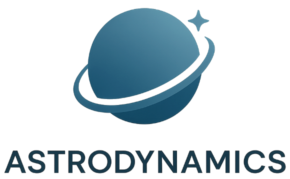

<div align="center">

  

  # Mission Eagle-1 — Pilote automatique lunaire

  **Apprentissage par Renforcement · LunarLander-v3 · Gymnasium**

  [](https://www.python.org)
  [](https://gymnasium.farama.org)
  [](https://stable-baselines3.readthedocs.io)
  [](https://fastapi.tiangolo.com)
  [](https://streamlit.io)
</div>

---

## Contexte

**AstroDynamics** développe des systèmes autonomes pour l'exploration spatiale.
Le module d'alunissage **Eagle-1** doit atterrir de manière précise et sécurisée
sur une zone cible lunaire, tout en optimisant la consommation de carburant.

Ce projet implémente un **pilote automatique basé sur le Reinforcement Learning**
pour contrôler Eagle-1 dans l'environnement simulé `LunarLander-v3` de Gymnasium.

**Critère de succès :** récompense moyenne ≥ 200 sur 100 épisodes consécutifs.

---

## Résultats obtenus

| Agent | Récompense moyenne | Écart-type | Critère ≥ 200 |
|-------|:-----------------:|:----------:|:-------------:|
| Baseline aléatoire | −193.6 | 105.5 | ✗ |
| DQN (SB3) | +196.9 | 96.2 | ✗ |
| **PPO (SB3)** | **+225.9** | **61.7** | **✓** |

---

## Architecture du projet

```
m11_ocr/
│
├── src/
│   ├── api.py              ← Backend FastAPI — toute la logique RL
│   ├── gui.py              ← Frontend Streamlit — GUI + Dashboard + Modèle
│   └── tools/
│       └── rafael/
│           └── log_tool.py ← Journalisation RFC 5424
│
├── notebooks/
│   ├── Eagle1_Mission_LunarLander.ipynb   ← Mission principale
│   ├── Notebook_exercice_1.ipynb          ← CartPole + politique aléatoire
│   ├── Notebook_exercice_2.ipynb          ← FrozenLake + Q-Learning
│   └── Notebook_exercice_3.ipynb          ← CartPole + DQN PyTorch + SB3
│
├── core/
│   ├── env_utils.py        ← make_env, inspect_env, run_n_random_episodes
│   ├── metrics.py          ← compute_stats, success_rate, moving_average
│   └── viz_utils.py        ← plot_episode_metrics, animate_episode
│
├── models/
│   ├── best_ppo/
│   │   └── best_model.zip  ← Meilleur modèle PPO (EvalCallback)
│   ├── best_dqn/
│   │   └── best_model.zip  ← Meilleur modèle DQN
│   └── ppo_lunarlander_XXX.json  ← Métadonnées run
│
├── logs/                   ← Logs TensorBoard (train + eval)
├── docs/
│   └── images/
│       ├── astrodynamics_logo.png
│       └── LunarLander_V3_Environement.png
└── pyproject.toml
```

---

## Installation

### Prérequis

- Python 3.12+
- [uv](https://docs.astral.sh/uv/) — gestionnaire de paquets
- CPU suffisant (GPU optionnel — entraînement ~30 min sur CPU)

### 1. Cloner le dépôt

```bash
git clone https://github.com/racemartin/m11_ocr.git
cd m11_ocr
```

### 2. Créer l'environnement virtuel et installer les dépendances

```bash
uv sync
```

### 3. Vérifier l'installation

```bash
uv run python -c "
import gymnasium as gym
import stable_baselines3 as sb3
import torch
print(f'Gymnasium  : {gym.__version__}')
print(f'SB3        : {sb3.__version__}')
print(f'PyTorch    : {torch.__version__}')
print(f'GPU        : {torch.cuda.is_available()}')
env = gym.make('LunarLander-v3')
env.close()
print('LunarLander-v3 : OK')
"
```

### 4. Installer les dépendances de déploiement

```bash
uv pip install fastapi uvicorn pillow requests streamlit imageio-ffmpeg
```

---

## Lancement des services

Les services sont indépendants — chaque terminal est dédié à un service.
**Lancer dans cet ordre.**

### Terminal 1 — API FastAPI (backend RL)

```bash
cd m11_ocr
uvicorn src.api:app --host 0.0.0.0 --port 8000
```

Vérifie que l'API répond :

```bash
curl http://localhost:8000/health
```

Documentation interactive disponible sur :
```
http://localhost:8000/docs
```

---

### Terminal 2 — GUI Streamlit (frontend)

```bash
cd m11_ocr
streamlit run src/gui.py
```

Accessible sur :
```
http://localhost:8501          # local
http://192.168.X.X:8501        # réseau local (IP du serveur Windows)
```

Dans la sidebar, configurer l'URL de l'API :
```
http://localhost:8000           # si GUI et API sur la même machine
http://192.168.X.X:8000         # si accès depuis une autre machine
```

---

### Terminal 3 — TensorBoard (visualisation entraînement)

```bash
cd m11_ocr
tensorboard --logdir logs/ --host 0.0.0.0 --port 6006
```

Accessible sur :
```
http://localhost:6006
```

Filtrer les runs par regex dans l'interface :
```
^mission.*ppo        ← logs PPO uniquement
^mission.*dqn        ← logs DQN uniquement
^mission.*ppo_eval   ← évaluations périodiques PPO
```

---

### Terminal 4 — JupyterLab (notebooks)

```bash
cd m11_ocr
uv run jupyter lab --no-browser --ip=0.0.0.0 --port 8888
```

Accessible sur :
```
http://localhost:8888/lab
http://192.168.X.X:8888/lab    # accès réseau local
```

---

## Pages de l'interface GUI

| Page | Description |
|------|-------------|
| **GUI Épisode** | Joue un épisode complet, anime frame par frame, affiche la télémétrie en temps réel (action, récompense, obs[8]), assemble et affiche le MP4 |
| **Dashboard** | Lance N épisodes, affiche les métriques agrégées, distribution des actions, décisions selon l'altitude, timeline du dernier épisode |
| **Modèle** | Hyperparamètres, résultats d'évaluation, comparaison baseline / DQN / PPO |

---

## Endpoints API

| Méthode | Endpoint | Description |
|---------|----------|-------------|
| `GET` | `/health` | État du service et infos du modèle actif |
| `POST` | `/action` | Reçoit `state[8]` → retourne `action` (0–3) |
| `POST` | `/episode` | Exécute un épisode complet → frames, rewards, actions, obs |
| `GET` | `/model/info` | Métadonnées JSON complètes du modèle |

---

## Environnement LunarLander-v3

```
Espace d'observation : Box(8,)  float32
  [0] x    position horizontale   [−∞, +∞] m
  [1] y    position verticale     [−∞, +∞] m
  [2] vx   vitesse horizontale    [−∞, +∞] m/s
  [3] vy   vitesse verticale      [−∞, +∞] m/s
  [4] θ    angle d'inclinaison    [−2π, +2π] rad
  [5] dθ   vitesse angulaire      [−∞, +∞] rad/s
  [6] cG   contact pied gauche    {0, 1}
  [7] cD   contact pied droit     {0, 1}

Espace d'action : Discrete(4)
  0 → do nothing
  1 → moteur gauche   (pousse vers la droite)
  2 → moteur principal (pousse vers le haut)
  3 → moteur droit    (pousse vers la gauche)

Structure de récompense (dense — accumulée pas à pas)
  Vol stabilisé    : + proportionnel (distance, vitesse, angle)
  Bonus zone cible : + 100  (final)
  Contact pied G   : +  10  (final)
  Contact pied D   : +  10  (final)
  Tir moteur princ.: −  0.30 / pas
  Tir moteur lat.  : −  0.03 / pas
  Crash / hors zone: − 100  (fin épisode)
```

---

## Notebooks des exercices préparatoires

Les trois exercices Gymnasium sont implémentés comme notebooks autonomes,
progressant des fondamentaux vers le Deep RL.

### Exercice 1 — Blocs de construction du RL (`CartPole-v1`)

**Objectif :** comprendre le cycle observation → action → récompense.

- Création et exploration de l'environnement `CartPole-v1`
- Inspection des espaces : `Box(4,)` continu + `Discrete(2)`
- Politique aléatoire : 100 épisodes, accumulation de récompense
- API Gymnasium moderne (`terminated or truncated`)

```bash
# Lancer le notebook
jupyter lab notebooks/Notebook_exercice_1.ipynb
```

---

### Exercice 2 — Q-Learning sur table de décision (`FrozenLake-v1`)

**Objectif :** implémenter Q-Learning from scratch sur un espace discret.

- Initialisation Q-table NumPy `(16, 4)` remplie de zéros
- Stratégie ε-greedy avec décroissance multiplicative
- Équation de Bellman implémentée pas à pas
- Évaluation avec ε = 0 (politique déterministe)
- Visualisation : heatmap Q-values, carte directionnelle, courbes TD-error

Hyperparamètres clés :
```python
ALPHA        = 0.1      # taux d'apprentissage
GAMMA        = 0.99     # facteur d'actualisation
EPSILON      = 1.0      # exploration initiale
EPSILON_MIN  = 0.01     # exploration minimale
N_EPISODES   = 10_000   # épisodes d'entraînement
```

```bash
jupyter lab notebooks/Notebook_exercice_2.ipynb
```

---

### Exercice 3 — Deep Q-Network (`CartPole-v1`)

**Objectif :** remplacer la Q-table par un réseau de neurones.

Deux implémentations en parallèle :

**Manuel (PyTorch)**
- Classe `DQN(nn.Module)` avec 3 couches `Linear` + activations `ReLU`
- `ReplayBuffer` avec `collections.deque` — experience replay
- Réseau cible (`target_net`) synchronisé périodiquement
- Boucle d'entraînement complète : sélection ε-greedy → step → optimize
- Logs TensorBoard via `SummaryWriter`

**SB3 (Stable-Baselines3)**
- `DQN('MlpPolicy', env)` — 4 lignes pour entraîner
- `EvalCallback` pour sauvegarde du meilleur modèle
- Comparaison directe des courbes manuel vs SB3 dans TensorBoard

Résultats obtenus :
```
DQN Manuel  : 226 pts (training) / 178 pts (eval)
DQN SB3     : 159 pts (mean_reward, 100 épisodes)
Objectif    : ≥ 200 pts
```

```bash
jupyter lab notebooks/Notebook_exercice_3.ipynb
```

---

## Reproductibilité

`seed=42` sur tous les entraînements, évaluations et animations.
Chaque run génère un fichier JSON dans `models/` avec l'ensemble des
hyperparamètres et des résultats — traçabilité complète.

---

## Auteur

**Rafael Cerezo Martín**

- Email : [rafael.cerezo.martin@icloud.com](mailto:rafael.cerezo.martin@icloud.com)
- GitHub : [@racemartin](https://github.com/racemartin)

---

## Licence

MIT License — voir [LICENSE](LICENSE) pour les détails.
